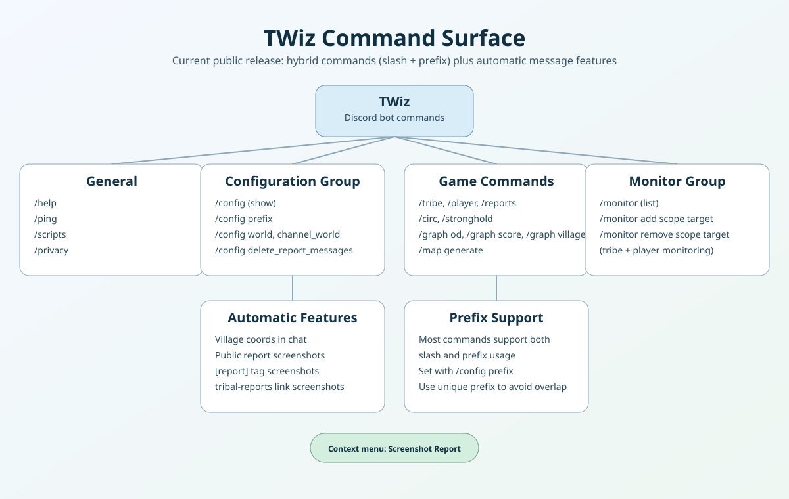

# TWiz Documentation

TWiz is a Discord bot for Tribal Wars with both slash and prefix command support.
It supports all regions/worlds and includes lookups, report screenshots, graphing, maps, and conquer monitoring.

## What changed

This documentation now matches the current bot behavior:

- Core features are available through hybrid commands (slash and prefix).
- Server and channel settings are managed from `/config ...`.
- Conquer alerts are managed from `/monitor ...`.
- Prefix overlap guidance is documented for multi-bot servers.

## Command surface at a glance

## Start here

- [Quick Start Guide](quickstartguide.md)
- [Command Reference](command-reference.md)
- [Configuration](configuration.md)
- [Privacy Policy](privacy.md)
