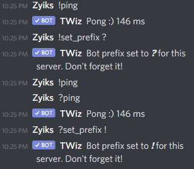

# Basic configuration

*You need "Manage Server" or "Administrator" permissions to use these commands.*

### Configuring command prefix

Command prefix is the letter added before every command eg. !help. By default it is the **exclamation mark "!"** symbol.

By using the command prefix, the bot knows you are asking it something. 

Sometimes, bot prefixes can conflict and as such, there is a command to change the prefix for TWiz.

You can do this with the following command:

> !set_prefix \<your_prefix here>

For example:

> !set_prefix ?

After using the command before, all commands have to use the new prefix for the bot to know you are referring to it eg. ?help.

### Configuring worlds

See [worlds](worlds.md)