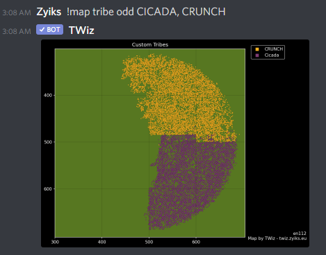

# Map Generation

This command generates up to 1 hour old maps. Operates similiar to Paul the Paladins &map command in the Official Tribal Wars Discord.

>!map \<player or tribe> \<comparison type> \<optional custom list>

The first parameter, **player or tribe**, lets you specify whetever you are looking to generate player or tribe graphs.

- t *i.e. tribe graph*
- p *i.e. player graph*

The second parameter, **comparison type**, lets you choose from the following map subtypes:

 - score *i.e. score, obviously*
 - odall *i.e. attack + defense + support OD*
 - oda *i.e. attack OD*
 - odd *i.e. defense OD*
 - ods *i.e. support NB! This type is only available for players OD*

The third parameter is an **optional custom list** of player or tribes. They should be comma separated. If no list is defined, it will default to the top 20 tribes.

Examples:
>!map player score *this generates top 20 player map based on score*

>!map player odall The Sleepless Elite, One Last Goodbye *this generates map based on od for 2 listed players*

>!map tribe oda *this generates top 20 tribe map based on attack od*

>!map tribe odd CICADA, CRUNCH *this generates tribe map based on defense od for the 2 listed tribes*

