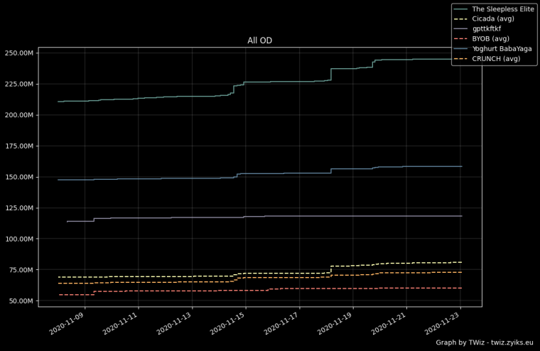

# Graph generation

### Graph Types available

There are 3 main graph types to choose from:

- od
- score
- villages

The following commands need a full case-insensitive name/tag match for each entry.

### Generating OD Graphs

The OD command has three parameters

> !od \<odtype> \<tribeorplayer> \<who>

The first parameter, **odtype**, lets you choose from the following graph subtypes:

 - all	*i.e. attack + defense + support*
 - a	*i.e. attack*
 - d	*i.e. defense*
 - s	*i.e. support NB! This type is only available for players*
 
The second parameter, **tribeorplayer**, lets you specify whetever you are looking to generate player or tribe graphs.

- t *i.e. tribe graph*
- p *i.e. player graph*

The third parameter, **who**, is a **comma "," seperated** list of players or tribes you want to generate the graph about.

- eg.  The Sleepless Elite,gpttkftkf,Yoghurt BabaYaga

By combining different parameter types, you can make different graphs. Here are a few possible command examples.

- !od all p The Sleepless Elite,gpttkftkf,Yoghurt BabaYaga *this command would show you a graph of total OD for the three specified players.*
- !od d t Cicada *this command would generate a od defensive graph about the tribe Cicada*

### Generating Score Graphs

> !score \<tribe or player> \<who>

The first parameter, **tribe or player**, lets you specify whetever you are looking to generate player or tribe graphs.

- t *i.e. tribe graph*
- p *i.e. player graph*

The second parameter, **who**, is a **comma "," seperated** list of players or tribes you want to generate the graph about.

- eg.  The Sleepless Elite,gpttkftkf,Yoghurt BabaYaga

### Generating Village Graphs

> !villages \<tribe or player> \<who>

The first parameter, **tribe or player**, lets you specify whetever you are looking to generate player or tribe graphs.

- t *i.e. tribe graph*
- p *i.e. player graph*

The second parameter, **who**, is a **comma "," seperated** list of players or tribes you want to generate the graph about.

- eg.  The Sleepless Elite,gpttkftkf,Yoghurt BabaYaga

