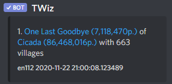
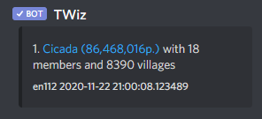

# Player and tribe lookup

Both commands try to find the closest match for your input in the world. 

Sorted by points.

If no name/tag is given, a Top 10 list is returned.

### Player Lookup

>!p \<name>

eg.

>!p One Last

### Tribe Lookup

>!t \<tag>

eg. 

>!t Cicada

