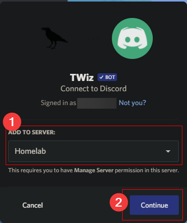
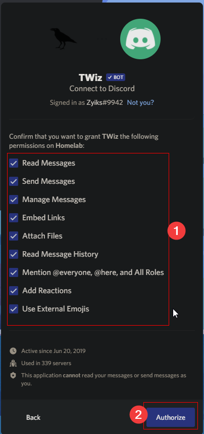
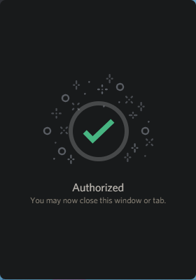

# Quick Start Guide

### Adding the bot to your Discord server

Prerequisites:
- You have "Manage Server" or "Administrator" permission on the server.

[If you have filled all of the prerequisites, open this link in a new tab.](https://discordapp.com/oauth2/authorize?&client_id=591226665951297537&scope=bot&permissions=519232)

After opening the tab, you will be greeted with the following pop-up. 

Under **Add to Server**, select the server you want to add it to. 

Then click **Continue**.

*If you do not see the server, it's either already added or the prerequisites are not filled.*

After that, you will see a list of permissions the bot wants from your server. 

Verify that you are comfortable with the **permissions**.

Then click **Authorize**.

*It can be dangerous to give bots more permissions than required. Malicious bots that ask for too many permissions can snoop in on all your conversations, kick/ban users or delete your server entirely.*

  
Permission explanations

  
- **Read Messages** - Needs to see incoming messages to respond to commands
- **Send Messages** - Needs to respond to commands
- **Manage Messages** - Needs to remove reactions from own posts to allow navigation on commands like !help, also deletes command messages after responding
- **Embed Links** - Allows to link to reports and other tribalwars links
- **Attach Files** - Allows to upload report images to Discord
- **Add Reactions** - Needs to add navigation commands to own posts so people can use them
- **Mention @everyone, @here, and All Roles** - May be used for future features, currently unused
- **Read message history** - Needs to be able to see old posts from bot to enable navigation and to automatically delete them.

If you see the following image, you have succeeded in adding the bot to your server.

You can see all the commands the bot has available with **!help** and go there from your own, or follow the guides in the sidebar to the left.