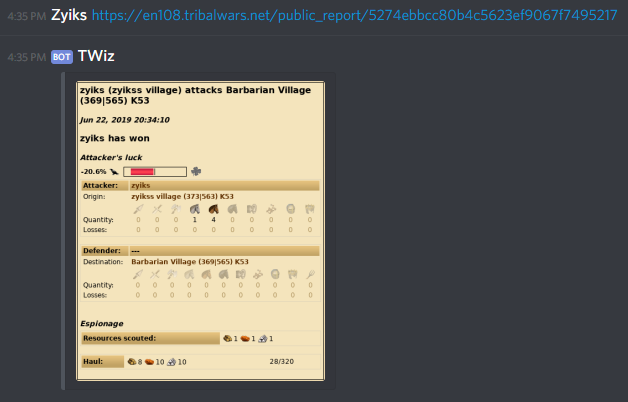

# Reports

### Posting and storing reports

To store a report, you simply need to post the **public share url** in the chat and the bot will pick it up and store it.

*Make sure the url contains /public_report/ in it, otherwise it's probably not the public share url.*

### Viewing past reports

To view past reports, you can use the following command:

> !r \<coords>

Example:

> !r 501|501