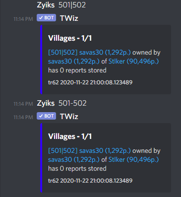

# Village lookup

Village lookup works without using any commands. The bot first checks all messages for possible coordinates in the following formats:

 - 000|000
 - 000-000

eg. 

These coordinates can be inside bigger texts or even several coordinates in one message.

*Remember, the bot first checks the channel world, then the global world!*